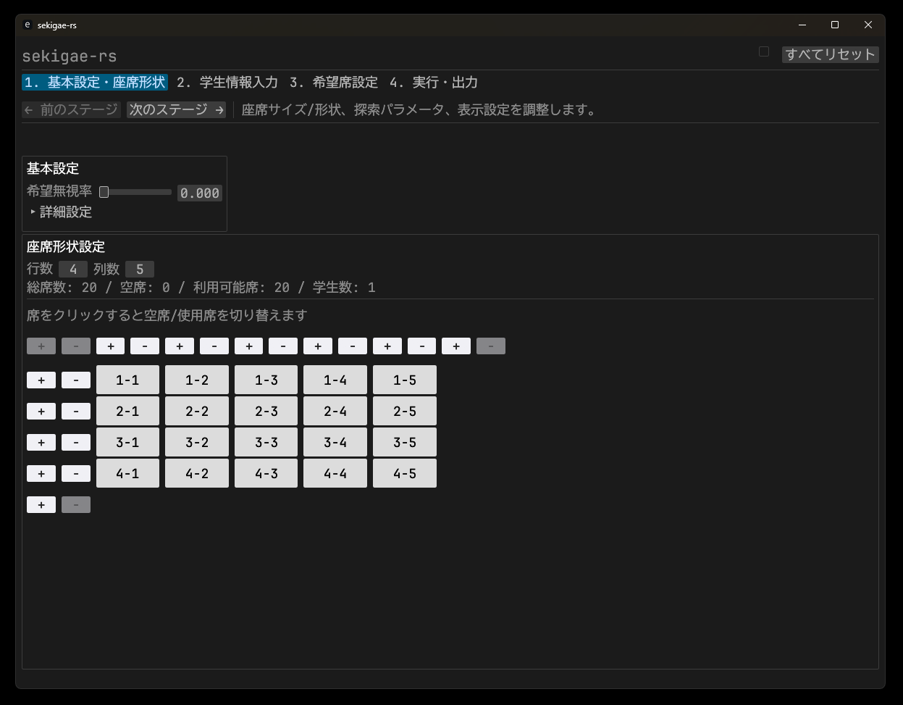

<h1 style="font-size: 50px">sekigae-rs</h1>

sekigae-rsは、席替え・座席表の出力を行うRust製のアプリケーションです。

## 機能
- 希望席、希望ペアに基づいた席替え
- 学生ごとのタグ登録と座席表への表示
- 席替えの結果をPDF,PNG,SVG形式で出力

# feature-flags
- 'google-fetch':   
  Google Sheetsからのデータの読み込みコードを有効にします。使用するには、Google Sheets API を含むconfig.jsonファイルが必要です。  
  コンパイル時に`cargo run --features google-fetch`フラグを指定して有効にしてください。  
  有効にすると`ステージ3`の`編集モード`に読み込みボタンが追加されます。